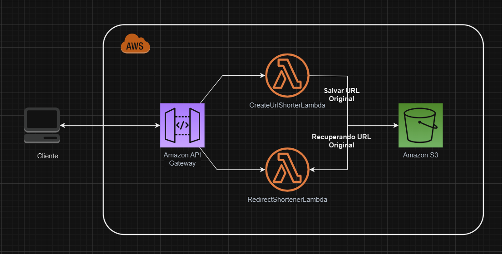
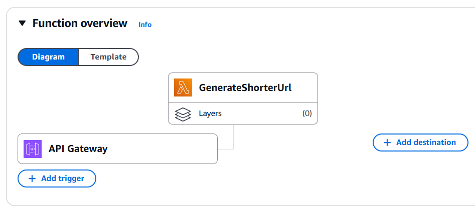
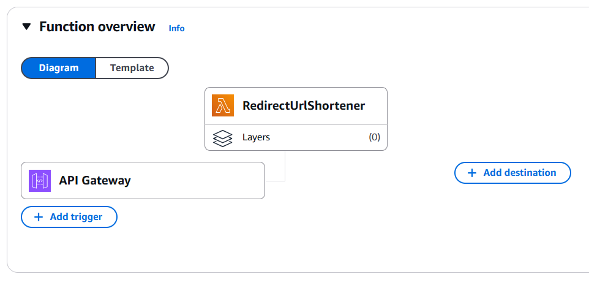
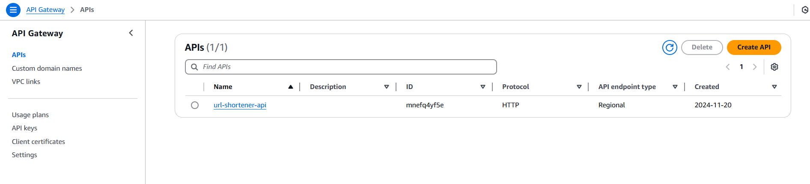

# URL Shortener Lab - Java + AWS Lambda

Este é um projeto **laboratório** criado para demonstrar como construir um **encurtador de URLs** utilizando **Java**, **AWS Lambda** e outros serviços da AWS, como o **API Gateway** e o **Amazon S3**. O projeto é dividido em duas funções Lambda principais:

1. **CreateUrlShortLambda**: Responsável por encurtar URLs e armazená-las.
2. **RedirectShortUrlLambda**: Recupera a URL original e redireciona o cliente.

---
## Arquitetura do Projeto

## 📋 Estrutura do Projeto

O projeto está organizado como um **multi-módulo Maven**, com os seguintes módulos:

### 1. **CreateUrlShortLambda**
- Endpoint: `/create`
- Gera uma URL encurtada a partir de uma URL original.
- Armazena o mapeamento entre a URL original e a encurtada no **Amazon S3**.

### 2. **RedirectShortUrlLambda**
- Endpoint: `/{UrlCode}`
- Busca a URL original no **Amazon S3** com base na URL encurtada.
- Redireciona o cliente para a URL original.

---

## 💡 Benefícios de Usar AWS Lambda

O uso de **AWS Lambda** para este tipo de aplicação traz várias vantagens, como:

- **Custo-efetividade**: Você paga apenas pelo tempo de execução da função, eliminando custos com servidores ociosos.
- **Escalabilidade automática**: As funções Lambda escalam automaticamente com o número de solicitações, garantindo alta disponibilidade.
- **Manutenção reduzida**: Como é serverless, você não precisa se preocupar em gerenciar servidores ou infraestrutura.
- **Flexibilidade**: Perfeito para workloads event-driven (baseados em eventos).

---

## 📘 Serviços AWS Utilizados

1. **AWS Lambda**:
    - Execução de funções serverless.
    - Lida com o processamento da lógica de negócios.

2. **Amazon API Gateway**:
    - Gerencia e expõe endpoints para as funções Lambda.
    - Atua como ponto de entrada para o cliente.

3. **Amazon S3**:
    - Utilizado como armazenamento de dados para salvar o mapeamento entre URLs originais e encurtadas.
    - Permite alta durabilidade e acesso rápido aos dados.

---

## ✅ Boas Práticas Adotadas

### Para Lambda
- **Funções Pequenas e Objetivas**: Cada função Lambda realiza apenas uma tarefa específica, seguindo o princípio **single-responsibility**.
- **Empacotamento com Maven**: Utilização do **maven-shade-plugin** para gerar arquivos `.jar` otimizados para deploy.
- **Logs Estruturados**: Logs implementados com **Log4j2**, facilitando o monitoramento e a depuração.
- **Uso de Dependências Leves**: Apenas as bibliotecas essenciais foram incluídas, reduzindo o tamanho do pacote.

### Para o Projeto
- **Multi-Módulo Maven**: Facilita a organização do código e a independência dos módulos.
- **Código Simples e Documentado**: Mantém o foco em uma implementação clara e didática, ideal para aprendizado.

---
### Algumas imagens na AWS para seguir de guia visual:

